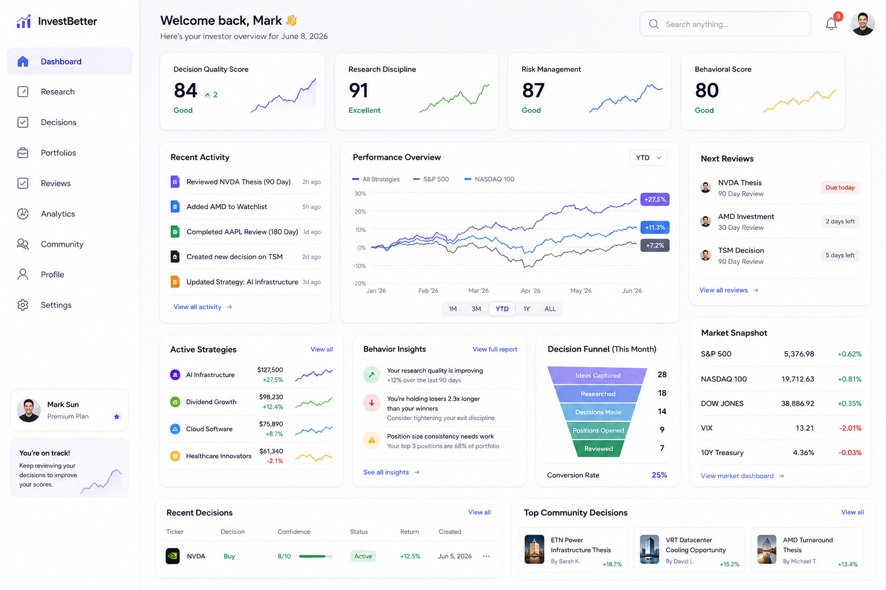

# Investor Development Platform Wireframe and UX Requirements

This document captures the UX requirements for the Investor Development Platform dashboard, using the `idp.png` wireframe as the source of truth for layout, content, and interaction expectations.

## 1. Purpose

Use the wireframe to define the experience for the investor dashboard and the top-level product flow for research, decisions, reviews, portfolios, analytics, and reputation.

## 2. UX objectives

- Provide a clear investor landing page that surfaces decision quality, research discipline, risk management, and behavioral signals.
- Make it easy for users to see recent activity and next review actions.
- Surface strategy performance in a single overview chart with a time-range selector.
- Highlight active investor strategies, behavior insights, decision funnel health, and market context.
- Support navigation to Research, Decisions, Portfolios, Reviews, Analytics, Community, Profile, and Settings.
- Enable a polished, modern dashboard that feels like a productivity tool for investor improvement.

## 3. Primary screen sections

### 3.1 Left navigation

- App branding and name
- Navigation links:
  - Dashboard
  - Research
  - Decisions
  - Portfolios
  - Reviews
  - Analytics
  - Community
  - Profile
  - Settings
- User profile summary and status callout
- Encouraging note to keep reviewing decisions

### 3.2 Top summary cards

- Decision Quality Score
- Research Discipline
- Risk Management
- Behavioral Score

Each card includes:
- numeric score
- status label (e.g. Good, Excellent)
- trend indicator or mini line chart

### 3.3 Recent activity

- List of recent actions with timestamps
- Activity types include reviewed thesis, added watchlist item, completed review, created decision, updated strategy
- Link to view all activity

### 3.4 Performance overview

- Multi-series line chart comparing:
  - All Strategies
  - S&P 500
  - NASDAQ 100
- Time range selector: 1M / 3M / YTD / 1Y / ALL
- Right-side summary badges showing percentage returns for each series

### 3.5 Next reviews

- Upcoming review cards showing:
  - Decision name
  - Review type and timing (e.g. 90 Day Review)
  - Due date or countdown
- Link to view all reviews

### 3.6 Active strategies

- Summary cards for active strategy portfolios:
  - Strategy name
  - Current value
  - Performance delta
- Link to view all strategies

### 3.7 Behavior insights

- Short insight statements with supporting metrics
- Examples from the wireframe:
  - Research quality trend
  - Holding losers versus winners
  - Portfolio concentration / position size discipline
- Link to view full report

### 3.8 Decision funnel

- Funnel visualization showing conversion from ideas to reviewed positions:
  - Ideas captured
  - Researched
  - Decisions made
  - Positions opened
  - Reviewed
- Conversion rate summary

### 3.9 Market snapshot

- Key market indices with current value and daily change:
  - S&P 500
  - NASDAQ 100
  - DOW JONES
  - VIX
  - 10Y Treasury
- Link to view market dashboard

### 3.10 Recent decisions

- Table of recent decisions with:
  - Ticker
  - Decision type (e.g. Buy)
  - Confidence
  - Status
  - Return
  - Created date
- Link to view all decisions

### 3.11 Top community decisions

- Card list of featured community decisions
- Each card includes:
  - Thesis title
  - Author
  - Performance metric
- Link to view all community decisions

## 4. UX requirements

- RQ-001: Dashboard landing must show the investor’s current decision quality and behavior scores in summary cards.
- RQ-002: The chart must provide a selectable time range and clearly compare platform strategy performance against benchmark indexes.
- RQ-003: Next review items must be easily scannable and show due dates.
- RQ-004: The active strategy cards must include strategy name, current value, and performance delta.
- RQ-005: Behavior insights must be presented as short, actionable statements rather than raw metrics.
- RQ-006: The decision funnel must show progression through stages of investor work.
- RQ-007: Market snapshot data is contextual and should include the major index values plus key macro rate information.
- RQ-008: Quick links should surface recent decisions and community signal examples.
- RQ-009: The navigation menu should maintain a strong visual hierarchy and support workspace-focused flows.
- RQ-010: The interface must use consistent card-based layouts, clear typography, and whitespace to prioritize readability.

## 5. Interaction requirements

- IR-001: Clicking a navigation item loads the corresponding workspace without full page refresh.
- IR-002: Clicking View all links navigates to the detailed page for activity, reviews, strategies, decisions, or community.
- IR-003: The time range selector updates the chart and summary values.
- IR-004: Dashboard cards may support hover states to reveal additional context or trends.

## 6. Visual requirements

- VR-001: Use a clean, light interface with subtle shadows and rounded cards.
- VR-002: Use distinct accent colors for score cards and chart series to improve scanability.
- VR-003: Use a consistent icon style for navigation and status badges.
- VR-004: Maintain adequate contrast and accessible text sizing.

## 7. Notes

- The wireframe should serve as the primary UX requirement for the investor dashboard experience.
- This doc may be extended with additional page wireframes or mobile variants as the product scope expands.

## 8. Change log

| Revision | Date | Status | Supersedes | Notes |
| --- | --- | --- | --- | --- |
| 0.1 | 2026-06-04 | draft | — | Initial wireframe and UX requirements document created from `idp.png`. |
